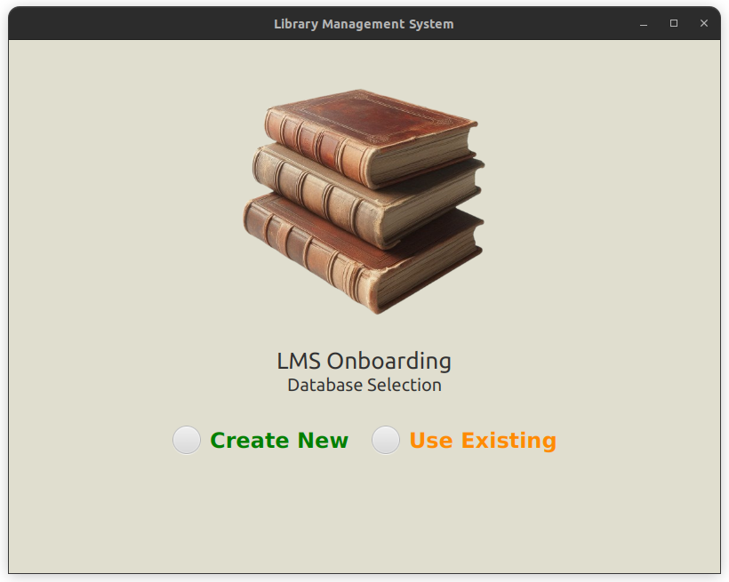
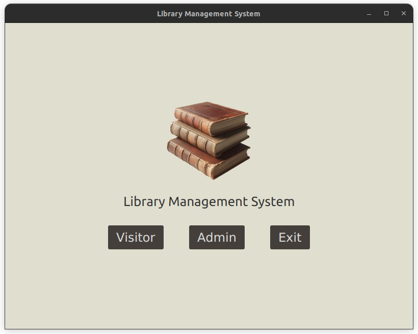
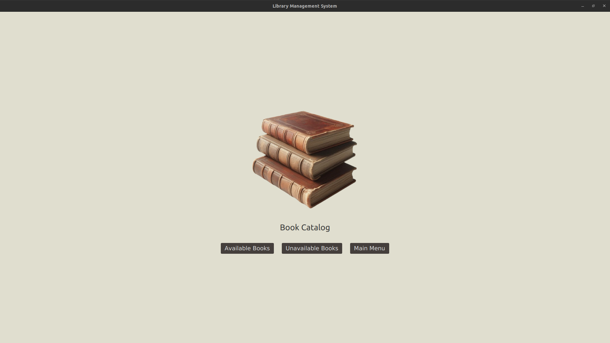
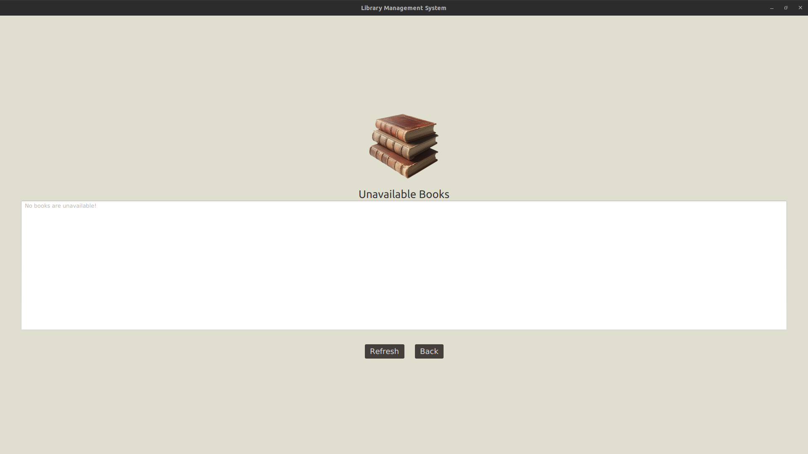
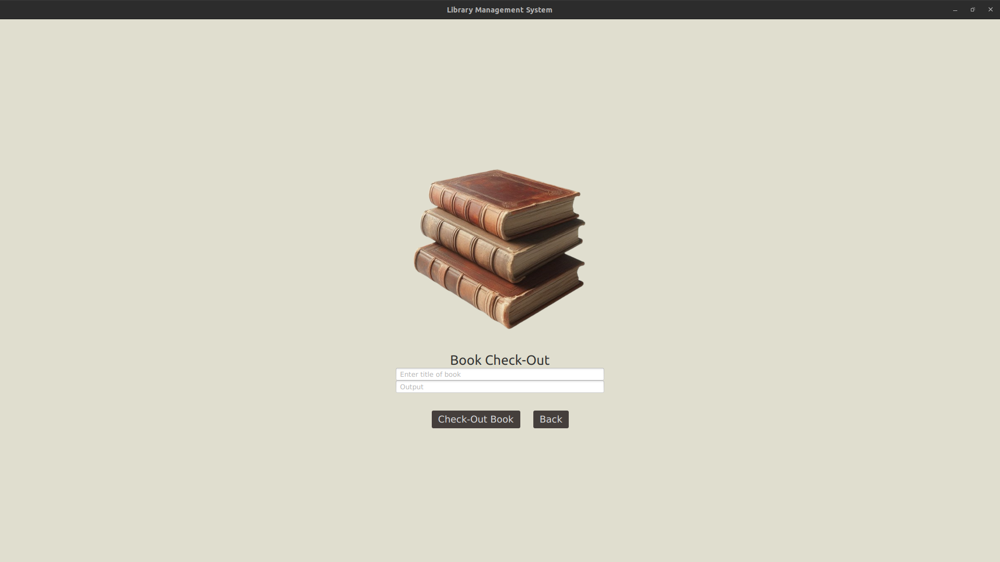
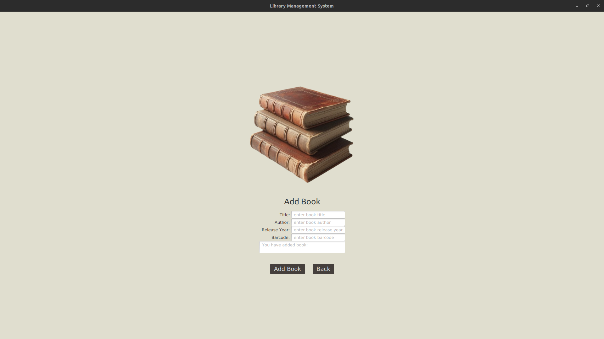

## Library Management System
Library Management System is a school project that allows for users to manage books in a library. Completed by me, Mauricio Diaz during the summer term of 2024 at Valencia College. The program was created using the Java programming language and other technologies, JavaFX framework and SceneBuilder for the graphical user interface, JUnit framework for simple testing of the program functions, Figma for GUI design, and SQLite for the database.

## Requirements
Requirements for the program to run.

Operating System: Linux

IDE: IntelliJ

For the program to run in any other IDE or Operating system, tinkering of the dependencies is required.

## Installation

To use the program you would need to clone the project using git using the following command in your desired directory.

```bash
git clone git@github.com:mdiaz007/LibraryManagementSystem.git
```
Once the program has been cloned then open it in IntelliJ and run the Main function.


## Screenshots












